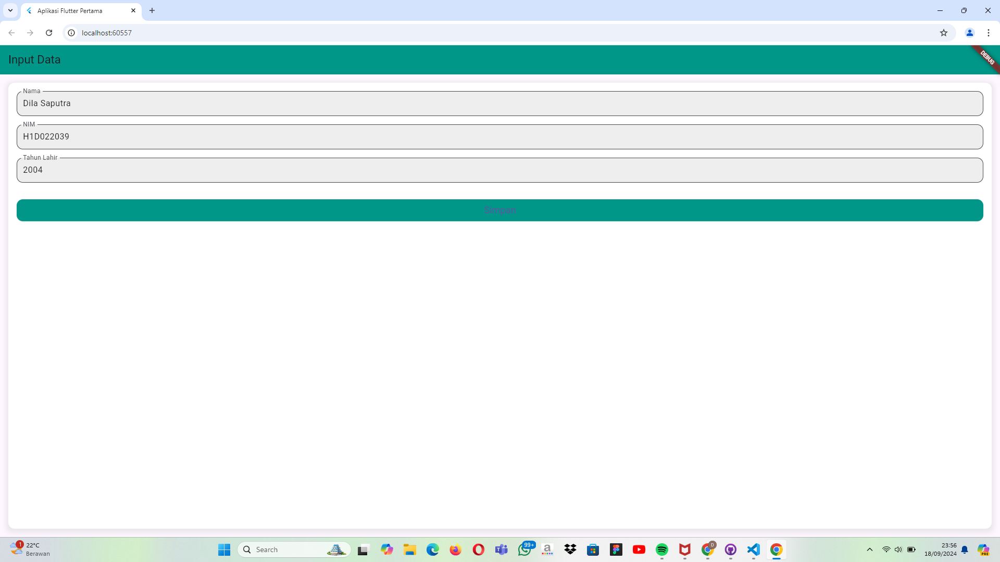

# Tugas Pertemuan 2

Fork dan clone repository ini, lalu jalankan perintah 
```
flutter pub get
```
Buatlah tampilan form yang berisi nama, nim, dan tahun lahir pada file `ui/form_data.dart`, lalu buatlah tampilan hasil dari input data tersebut pada file `ui/tampil_data.dart`

JELASKAN PROSES PASSING DATA DARI FORM MENUJU TAMPILAN DENGAN FILE `README.md`

Buat tampilan semenarik mungkin untuk dilihat.


Nama : Dila Saputra

NIM : H1D022039

Shift Baru: E

## Screenshot
Contoh :





# Proses Passing Data dari Form Menuju Tampilan

Dalam aplikasi Flutter ini, kita memiliki dua layar utama: layar input data (`FormData`) dan layar hasil data (`TampilData`)· Berikut adalah penjelasan tentang bagaimana data dipassing dari satu layar ke layar lainnya·

1· Struktur Project

- `lib/ui/form_data·dart`: File ini berisi tampilan form untuk memasukkan data (nama, NIM, tahun lahir)·
- `lib/ui/tampil_data·dart`: File ini berisi tampilan untuk menampilkan hasil data yang dimasukkan di form·

2· Proses Passing Data

Langkah 1: Mengisi Formulir

Pada `FormData`, pengguna memasukkan data ke dalam form yang terdiri dari tiga `TextField`:


Langkah 2: Menekan Tombol Simpan

Ketika tombol "Simpan" ditekan, data yang dimasukkan dalam `TextEditingController` diambil dan diproses· Fungsi `onPressed` pada `ElevatedButton` bertanggung jawab untuk membuat objek `TampilData` dengan data yang diinputkan dan menavigasi ke layar `TampilData` menggunakan `Navigator·of(context)·push()`·

Langkah 3: Navigasi ke Tampilan Hasil

Data yang diinputkan dipassing ke `TampilData` melalui konstruktor· `TampilData` kemudian menampilkan data tersebut dengan format yang lebih menarik·


3· Tampilan

Tampilan pada kedua layar dirancang untuk menarik dengan:
- Penggunaan `Container` dengan `BoxDecoration` untuk memberikan latar belakang, border radius, dan bayangan·
- Penataan elemen dengan `Padding` dan `SizedBox` untuk jarak antar elemen·
- Warna yang konsisten dan font yang jelas untuk meningkatkan pengalaman pengguna·

4· Testing

Untuk memastikan aplikasi berjalan dengan baik:
- Jalankan aplikasi di emulator atau perangkat fisik·
- Pastikan data ditampilkan dengan benar di layar hasil·

